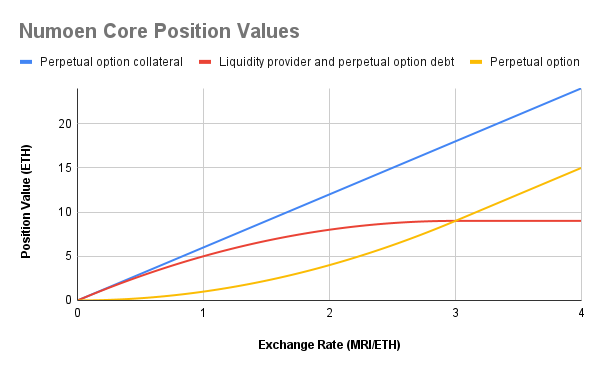

# Numoen Core Algorithm

Automated Market Makers (AMMs) utilize a trading function $$\varphi$$ as a generalized pricing algorithm for pooled liquidity. The purpose is to maintain the a desired state for two reserves that are provided by liquidity providers (LPs). But completely autonomously through the use of arbitrageurs. Therefore, an AMM can be thought of an automated portfolio manager where the payoff of the portfolio can be altered by changing the trading function. Using this insight, Numoen has implemented a trading function that allows for the creation of perpetual options.

## Trading Function

The algorithm we describe in Numoen Core pools liquidity to an invariant that follows:

$$
\varphi(R_{1}, R_{2}) = R_{1}-\left(p_{1}^{2}-\frac{1}{2}R_{2}\right)^{2}
$$

This produces a payoff is quadratic and convex payoff if levered. Offering a payoff similar to a call option in traditional finance. Important to note, without leverage, this can be statically replicated to produce a concave payoff on a constant product curve within a bounded space.

<figure><figcaption>
The yellow line illustrates the perpetual option (capped power) payoff
</figcaption></figure>

It has been shown that this results in a portfolio value with $$p$$ being the price of speculative asset in terms of base asset:

$$
V(p)=
    \begin{cases}
        2p*p_{1}-p^{2} & 0\le p\le p_{1}\\
        p_{1}^{2} & p > p_{1}
    \end{cases}
$$

Liquidity providers receive a share representing their deposit into the underlying liquidity pool. This share is then deposited in a specialized lending pool and made available to borrowers. Liquidity provider positions are represented as a struct with extra variables to account for accrued funding rewards shown below:

|         | Variable               |
| ------- | ---------------------- |
| uint256 | liquidity              |
| uint256 | rewardPerLiquidityPaid |
| uint256 | tokensOwed             |

To construct the capped power payoff, the buyer of the Numoen options is borrowing a LP share and issuing debt with the speculative asset as the collateral. Now the portfolio value becomes:

$$
N(p)=
    \begin{cases}
        p^{2} & 0\le p\le p_{1}\\
        2p*p_{1} -p_{1}^{2} & p > p_{1}
    \end{cases}
$$


The payoff only replicates up to a statically set upper bound. Once this bound is met, the payoff becomes linear.&#x20;

