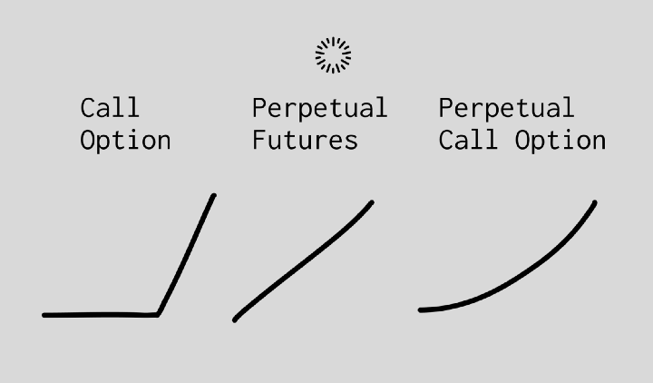

# Perpetual Options

Traditionally, options are financial instruments that give a buyer the right but not the obligation to buy the underlying asset at some agreed upon price before the option to do so expires. In finance, they represent some of the most commonly traded instruments in the world and are essential to how portfolios are constructed and risk is managed. On the otherhand, options in DeFi are virtually non-existant. Perpetual options are an attempt by the Paradigm research team to bring the convexity of an options exposure to users.&#x20;

## Squared Exposure

With a perpetual call option, any asset has squared exposure on gains. Since leverage on an option is embedded, 2x leverage stays continuous at any price. This results in the squaring of gains. So if the price moves up by 2X, then your gains increase by 4X. Or if the price increases by 4X, your gains increase by 16X. Giving buyers constant gamma exposure in DeFi with no liquidation risk.

<figure><figcaption></figcaption></figure>

