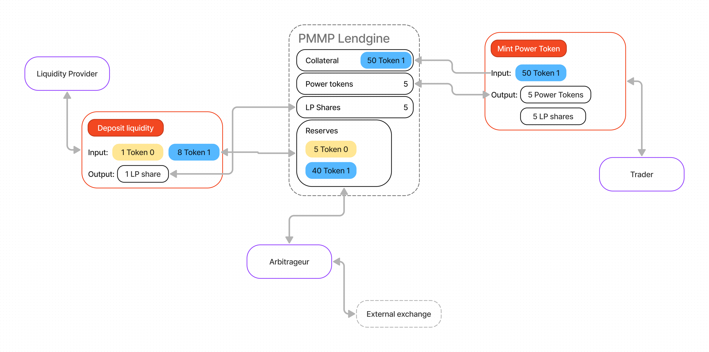

# Overview

<figure><figcaption></figcaption></figure>

PMMP is a fully autonomous protocol built to run on the Ethereum Virtual Machine. It is implemented in a system of non-upgradeable smart contracts. It obviates the need for trusted intermediaries, prioritizing **decentralization**, **censorship resistance**, and **security**. PMMP is **open-source software** licensed under the [GPL](https://en.wikipedia.org/wiki/GNU\_General\_Public\_License).

Each PMMP smart contract or lendgine, short for lending engine, manages a liquidity pool made up of reserves of two [ERC-20](https://eips.ethereum.org/EIPS/eip-20) tokens as well as the borrowers of this liquidity.

## Lendgines

Each lendgine is described by two ERC20 token address, each with a exponential that is essentially a multiplier. Tokens in a lendgine are not interchangeable, meaning that depending on the order in which they are entered, an entirely different market can be created. This is different from Uniswap or Curve markets because they are essentially symmetrical. The first token is the quote token or the token that is being shorted. The second token is the base token or the token that is being longed. Token exponentials are required for precision in accounting logic and are in most cases equivalent to 18 - decimals in a token.

Lendgines also have an upper bound parameter. This upper bound is the price at which the underlying automated market maker is swapped entirely into the quote token. For Power Token holders, this is the price at which leverage stops constantly adjusting. Above the upper bound, a Power Token will have leverage that is less than 2.

## Power Tokens

Each Power Token is implemented as an ERC20. There is one Power Token per lendgine and they are completely fungible.

## Liquidity provider positions

Each liquidity provider position is a custom struct that contains the size of the position, the rewardPerSize of the last accrual of the position, and the amount of tokens owed to the position.&#x20;

## Interest rate model

The interest rate between liquidity providers and Power Token holders is determined using the [jump rate model](https://docs.compound.finance/interest-rates/). PMMP uses static parameters for the jump rate model that we determined using historical backtesting data.

In the research blog [On-chain Volatility and Uniswap v3](https://lambert-guillaume.medium.com/on-chain-volatility-and-uniswap-v3-d031b98143d1), it is demonstrated that LP positions are analogous selling an option and pricing follows a Geometric Brownian Motion. Using the liquidity on token pairs on Uniswap V3, we have derived the on-chain historical implied volatility, σ for each token pair. Jump rate parameters are found by taking the square root of the quotient of daily volume α over the tick liquidity β multiplied by the fee tier φ \* 2. The equation is as follows:&#x20;

$$
σ = 2φ √ α β (6)
$$

So using the most recent data on the most liquid pairs on the .3% fee tier, we estimate 105.1% to be the average implied volatility and used that to determine our parameters.

<table><thead><tr><th width="388">Variable</th><th width="115">Value</th><th data-hidden></th></tr></thead><tbody><tr><td>Kink</td><td>.8</td><td></td></tr><tr><td>Multiplier</td><td>1.375</td><td></td></tr><tr><td>Jump multiplier</td><td>44.5</td><td></td></tr></tbody></table>
